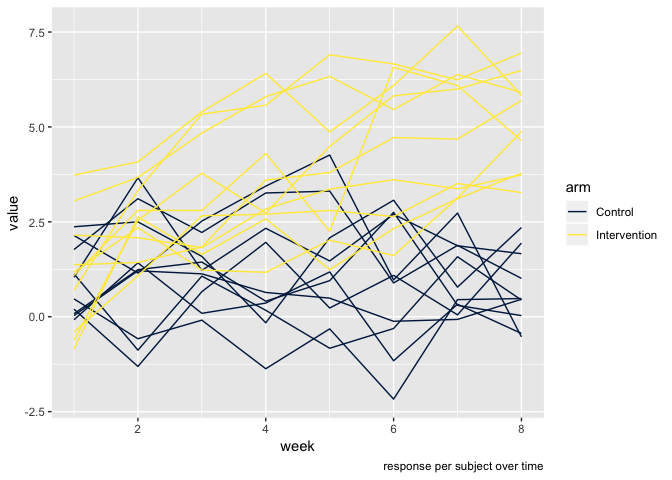
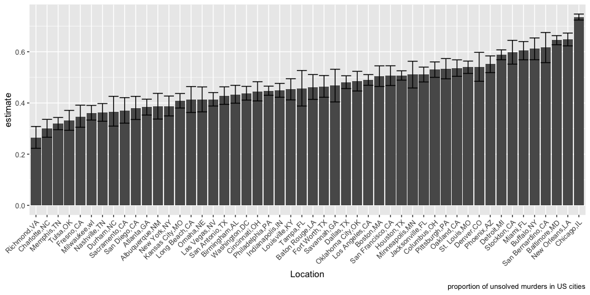

HW5
================
Nathalie Fadel
11/7/2018

Problem 1
=========

Data import and cleaning
------------------------

``` r
names = list.files("./data", full.names = TRUE)

data = names %>%
  map(read_csv)
```

    ## Parsed with column specification:
    ## cols(
    ##   week_1 = col_double(),
    ##   week_2 = col_double(),
    ##   week_3 = col_double(),
    ##   week_4 = col_double(),
    ##   week_5 = col_double(),
    ##   week_6 = col_double(),
    ##   week_7 = col_double(),
    ##   week_8 = col_double()
    ## )
    ## Parsed with column specification:
    ## cols(
    ##   week_1 = col_double(),
    ##   week_2 = col_double(),
    ##   week_3 = col_double(),
    ##   week_4 = col_double(),
    ##   week_5 = col_double(),
    ##   week_6 = col_double(),
    ##   week_7 = col_double(),
    ##   week_8 = col_double()
    ## )
    ## Parsed with column specification:
    ## cols(
    ##   week_1 = col_double(),
    ##   week_2 = col_double(),
    ##   week_3 = col_double(),
    ##   week_4 = col_double(),
    ##   week_5 = col_double(),
    ##   week_6 = col_double(),
    ##   week_7 = col_double(),
    ##   week_8 = col_double()
    ## )
    ## Parsed with column specification:
    ## cols(
    ##   week_1 = col_double(),
    ##   week_2 = col_double(),
    ##   week_3 = col_double(),
    ##   week_4 = col_double(),
    ##   week_5 = col_double(),
    ##   week_6 = col_double(),
    ##   week_7 = col_double(),
    ##   week_8 = col_double()
    ## )
    ## Parsed with column specification:
    ## cols(
    ##   week_1 = col_double(),
    ##   week_2 = col_double(),
    ##   week_3 = col_double(),
    ##   week_4 = col_double(),
    ##   week_5 = col_double(),
    ##   week_6 = col_double(),
    ##   week_7 = col_double(),
    ##   week_8 = col_double()
    ## )
    ## Parsed with column specification:
    ## cols(
    ##   week_1 = col_double(),
    ##   week_2 = col_double(),
    ##   week_3 = col_double(),
    ##   week_4 = col_double(),
    ##   week_5 = col_double(),
    ##   week_6 = col_double(),
    ##   week_7 = col_double(),
    ##   week_8 = col_double()
    ## )
    ## Parsed with column specification:
    ## cols(
    ##   week_1 = col_double(),
    ##   week_2 = col_double(),
    ##   week_3 = col_double(),
    ##   week_4 = col_double(),
    ##   week_5 = col_double(),
    ##   week_6 = col_double(),
    ##   week_7 = col_double(),
    ##   week_8 = col_double()
    ## )
    ## Parsed with column specification:
    ## cols(
    ##   week_1 = col_double(),
    ##   week_2 = col_double(),
    ##   week_3 = col_double(),
    ##   week_4 = col_double(),
    ##   week_5 = col_double(),
    ##   week_6 = col_double(),
    ##   week_7 = col_double(),
    ##   week_8 = col_double()
    ## )
    ## Parsed with column specification:
    ## cols(
    ##   week_1 = col_double(),
    ##   week_2 = col_double(),
    ##   week_3 = col_double(),
    ##   week_4 = col_double(),
    ##   week_5 = col_double(),
    ##   week_6 = col_double(),
    ##   week_7 = col_double(),
    ##   week_8 = col_double()
    ## )
    ## Parsed with column specification:
    ## cols(
    ##   week_1 = col_double(),
    ##   week_2 = col_double(),
    ##   week_3 = col_double(),
    ##   week_4 = col_double(),
    ##   week_5 = col_double(),
    ##   week_6 = col_double(),
    ##   week_7 = col_double(),
    ##   week_8 = col_double()
    ## )
    ## Parsed with column specification:
    ## cols(
    ##   week_1 = col_double(),
    ##   week_2 = col_double(),
    ##   week_3 = col_double(),
    ##   week_4 = col_double(),
    ##   week_5 = col_double(),
    ##   week_6 = col_double(),
    ##   week_7 = col_double(),
    ##   week_8 = col_double()
    ## )
    ## Parsed with column specification:
    ## cols(
    ##   week_1 = col_double(),
    ##   week_2 = col_double(),
    ##   week_3 = col_double(),
    ##   week_4 = col_double(),
    ##   week_5 = col_double(),
    ##   week_6 = col_double(),
    ##   week_7 = col_double(),
    ##   week_8 = col_double()
    ## )
    ## Parsed with column specification:
    ## cols(
    ##   week_1 = col_double(),
    ##   week_2 = col_double(),
    ##   week_3 = col_double(),
    ##   week_4 = col_double(),
    ##   week_5 = col_double(),
    ##   week_6 = col_double(),
    ##   week_7 = col_double(),
    ##   week_8 = col_double()
    ## )

    ## Parsed with column specification:
    ## cols(
    ##   week_1 = col_double(),
    ##   week_2 = col_double(),
    ##   week_3 = col_double(),
    ##   week_4 = col_double(),
    ##   week_5 = col_double(),
    ##   week_6 = col_double(),
    ##   week_7 = col_integer(),
    ##   week_8 = col_double()
    ## )

    ## Parsed with column specification:
    ## cols(
    ##   week_1 = col_double(),
    ##   week_2 = col_double(),
    ##   week_3 = col_double(),
    ##   week_4 = col_double(),
    ##   week_5 = col_double(),
    ##   week_6 = col_double(),
    ##   week_7 = col_double(),
    ##   week_8 = col_double()
    ## )
    ## Parsed with column specification:
    ## cols(
    ##   week_1 = col_double(),
    ##   week_2 = col_double(),
    ##   week_3 = col_double(),
    ##   week_4 = col_double(),
    ##   week_5 = col_double(),
    ##   week_6 = col_double(),
    ##   week_7 = col_double(),
    ##   week_8 = col_double()
    ## )
    ## Parsed with column specification:
    ## cols(
    ##   week_1 = col_double(),
    ##   week_2 = col_double(),
    ##   week_3 = col_double(),
    ##   week_4 = col_double(),
    ##   week_5 = col_double(),
    ##   week_6 = col_double(),
    ##   week_7 = col_double(),
    ##   week_8 = col_double()
    ## )
    ## Parsed with column specification:
    ## cols(
    ##   week_1 = col_double(),
    ##   week_2 = col_double(),
    ##   week_3 = col_double(),
    ##   week_4 = col_double(),
    ##   week_5 = col_double(),
    ##   week_6 = col_double(),
    ##   week_7 = col_double(),
    ##   week_8 = col_double()
    ## )
    ## Parsed with column specification:
    ## cols(
    ##   week_1 = col_double(),
    ##   week_2 = col_double(),
    ##   week_3 = col_double(),
    ##   week_4 = col_double(),
    ##   week_5 = col_double(),
    ##   week_6 = col_double(),
    ##   week_7 = col_double(),
    ##   week_8 = col_double()
    ## )
    ## Parsed with column specification:
    ## cols(
    ##   week_1 = col_double(),
    ##   week_2 = col_double(),
    ##   week_3 = col_double(),
    ##   week_4 = col_double(),
    ##   week_5 = col_double(),
    ##   week_6 = col_double(),
    ##   week_7 = col_double(),
    ##   week_8 = col_double()
    ## )

``` r
for (i in 1:20)
  if (i <= 10) {
    data[[i]] = data[[i]] %>% 
      mutate(arm = "Control", study_id = i)
  } else if (i > 10) {
    data[[i]] = data[[i]] %>% 
      mutate(arm = "Intervention", study_id = i - 10)
  }

data = bind_rows(data) %>%
  gather(key = "week", week_1:week_8, value = "value") %>%
  mutate(week = as.numeric(str_extract(week, "\\d"))) 
```

I used the map function to create a list of the data, and then the for loop to organize it into a functional dataset. There are 20 csv files that we need to combine, 10 of each group (10 control and 10 intervention). The first 10 are controls, so we can use the ith iteration to designate study ID. After that, the study IDs repeat for each person in the intervention arm, so we need to use i-10 to ID these entries. Then, I used a gather function to turn weeks 1-8 into one column, and converted it to a numeric variable.

Plot
----

``` r
data %>%
  mutate(study_id = as.character(study_id)) %>%
  group_by(arm, study_id) %>%
  ggplot(aes(x = week, y = value, color = arm, type = study_id)) +
  geom_line() +
  labs(y = "value", caption = "response per subject over time")+
  scale_color_viridis(option = "cividis", discrete = TRUE)
```

 In order for each study ID to show up as an individual line, I had to convert it to a character variable. As we can see from the plot, by the end of the study period (week 8), there is a substantial difference between the response of the control group versus the intervention.

Problem 2
=========

Data import and cleaning
------------------------

``` r
murder_data = read_csv("https://raw.githubusercontent.com/washingtonpost/data-homicides/master/homicide-data.csv")
```

    ## Parsed with column specification:
    ## cols(
    ##   uid = col_character(),
    ##   reported_date = col_integer(),
    ##   victim_last = col_character(),
    ##   victim_first = col_character(),
    ##   victim_race = col_character(),
    ##   victim_age = col_character(),
    ##   victim_sex = col_character(),
    ##   city = col_character(),
    ##   state = col_character(),
    ##   lat = col_double(),
    ##   lon = col_double(),
    ##   disposition = col_character()
    ## )

``` r
murder_data = murder_data %>%
  unite("city_state", c("city", "state"), sep = ",", remove = TRUE)

unsolved_cases =
  murder_data %>%
  filter(disposition %in% c("Open/No arrest", "Closed without arrest")) %>%
  group_by(city_state) %>%
  summarize(unsolved_cases = n())

total_murders =
  murder_data %>%
  group_by(city_state) %>%
  summarize(total = n())

total_cases = 
  left_join(unsolved_cases, total_murders, by = "city_state")
```

Here, I used a unite function to make city and state one variable. Then, I made unsolved cases and total murders into their own datasets, and combined them together so that the resulting dataset is just 3 columns: city and state, unsolved cases, and total murders.

Function
--------

``` r
p_unsolved = function(df) {
  cl_unsolved = prop.test(df$unsolved_cases, df$total)
  
  broom::tidy(cl_unsolved) %>% 
    select(estimate, conf.low, conf.high)
    }

total_cases %>%
  filter(city_state == "Baltimore,MD") %>%
  p_unsolved %>%
  rename("lower bound" = conf.low, "upper bound" = conf.high) %>%
  knitr::kable() 
```

|   estimate|  lower bound|  upper bound|
|----------:|------------:|------------:|
|  0.6455607|    0.6275625|    0.6631599|

``` r
city_nest = nest(total_cases, unsolved_cases:total)

unsolved_cl = city_nest %>% 
  mutate(p_unsolved = map(data, p_unsolved)) %>% 
  unnest() %>%
  rename(lb = conf.low, ub = conf.high)
```

The function makes a new dataset containing the proportion of unsolved murders in each city and state using prop.test and calling in the datsets I created in the previous step. The broom::tidy tidies the dataset and I selected to keep the point estimate, and lower and upper CLs. Then, to just look at Baltimore I filtered the newly created p\_unsolved dataset. After that, I made a nested dataset to display two columns from the total cases dataset (unsolved and total) into one. Then, the confidence limits on the estimate of each city can be found by feeding in the nested dataset, mutating it using the map to make a list, un-nesting to expand it again, and renamed the upper and lower bound columns.

Plot
----

``` r
unsolved_cl %>%
  mutate(city_state = forcats::fct_reorder(city_state, estimate)) %>%
  ggplot(aes(x = city_state, y = estimate)) +
  geom_col() +
  geom_errorbar(aes(ymin = lb, ymax = ub)) +
  theme(axis.text.x = element_text(angle=45, hjust=1)) +
  labs(x = "Location", caption = "proportion of unsolved murders in US cities")
```

 I used the forcats::fct\_reorder function to order the cities by point estimate of the proportion of unsolved murders. This way the bar chart will be ordered from least to greatest. The geom\_errorbar feature puts the error bars on each point estimate to display the confidence interval found in the previous step.

From the graph we can see that Chicago, IL has the highest unsolved murder rate in the US, with approximately 90% of all murder cases unsolved. Richmond, VA has the lowest unsolved murder rate, at approximately 25%.

*Author's note: I asked my girlfriend, who is from New Orleans, if she knew that her home city has the 2nd highest unsolved murder rate, and she was hardly surprised. She said "when my friend was murdered, the police didn't even investigate. They usually don't even bother."*
